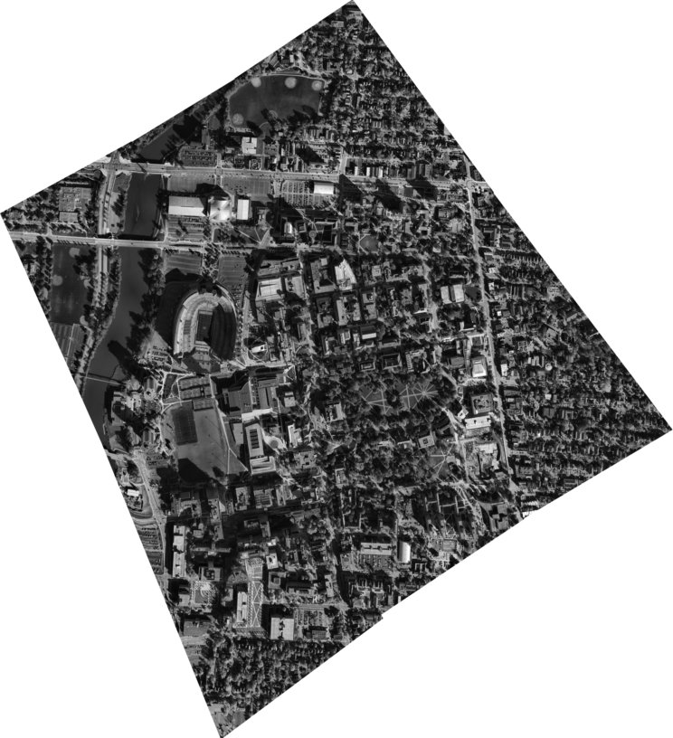
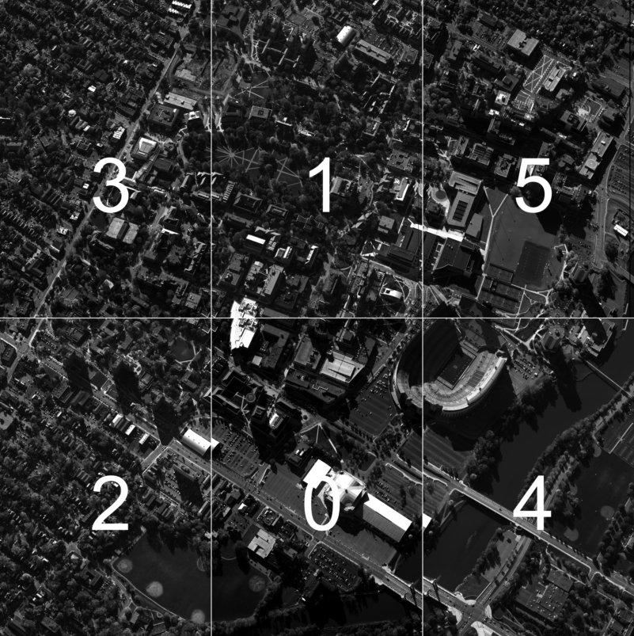
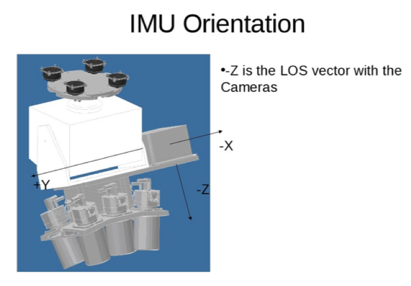
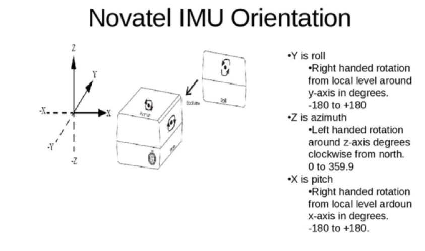

# Columbus Large Image Format (CLIF) 2007 Dataset Overview

## Overview
		
The CLIF dataset contains imagery from a large format EO platform. The data
was collected in October 2007. The scene in this dataset is a flyover of the
Ohio State University (OSU) Campus. The platform approaches the campus and
loiters over the area for several hours.  The OSU campus is a busy city 
environment with many vehicles and humans in the scene.  Below is a figure 
from file "20071028142502-01000100-VIS.ntf.r1" with all six cameras stitched 
then north oriented.  At full resolution each frame is approximately 66 mega 
pixels.




## Airborne Sensor Hardware

The sensor is a large format monochromatic electro-optical sensor comprised
of a matrix of six cameras. The matrix is 2 rows by 3 columns. Cameras 3, 1,
and 5 make-up the top row of the image, respectively. Cameras 2, 0, and 4 
make-up the bottom row of the image. Each camera was oriented in such way as 
to maximize coverage, yet allow enough overlap between images to help in 
mosaicking the image to form a larger image. Overlap between cameras is 
apprixmatley 50 pixels.  The cameras, for this data collection, collect data
at approximately 2 frames per second.

To better understand the camera orientation imagine that you are looking
through the CLIF camera head, you would see what is shown in the figure
below.  In order to optimize performance of the CLIF camera system the data was 
stored inverted so each image has to be rotated.  The images on the top row 
are rotated counter clockwise 90 degrees while the images on the bottom row
are rotated clockwise 90 degrees. Camera numbers have been in embeded in the 
figure below for illustrative purposes only, the camera numbers are not 
stored in the imagery.   




 
Each camera was made by Illunis employing a Kodak KAI-11002 charge coupled
device (CCD).  The optics are Canon 135 MM EF mount lens controlled with
a Birger adapter.  Unfortunately both the CCD and camera have been discontinued.
On the rear of the camera head was a Novatel DL4 Plus SPAN with a Honeywell
HG1700_AG11 inertial measurement unit (IMU).   The entire integrated system
is shown below. 



Orientation of the IMU is an important consideration when performing image
projections with the RAW data.  The IMU orientations are depicted in the
figure below.



## CLIF 2007 Data Products

Four data products are available with the CLIF data set raw, NITF, 
truth/labels, and position data. Raw or unprocessed data is available 
for the CLIF 2007 data set and is described in the section below.  Raw data
requires a high level of expertise in remote sensing to be able to process 
in a meaningful way.  For some research like super resolution and 3D 
reconstruction, raw data is required. In addition we have provided processed
data in the DoD's NITF file standard which is described below.  NITF data is 
stitched, orthorectified (north orienterd), and scaled for display to the user.
NITF data could be used in conjuction with the truth/labels for interesting
image classification and tracking problems.  

### Raw Image Data

The CLIF 2007 data set includes "raw" data which is image data that is unprocessed 
for each of the six cameras.  Each raw image is 4,016 pixels by 2,672 pixels, in 
8-bits per pixel grayscale raw format with an approximate size of 11 megabytes 
for each camera.

#### Raw File Naming Convention

The first six characters in the file name denote the camera number while the 
last eight characters represent the flight number (first two digits) and the 
frame number (last six digits).  Both the camera number and the frame number
are padded with zeros at the front to insure the file names are automatically 
sorted correctly when listing a directory. A example file name is 
000003-01001000.raw, where 000003 is camera number three, 01 is flight number 
one, and 001000 is frame number one thousand.   

#### Raw Image Storage

The raw images are stored in standard "gzip tarballs" in Amazon S3 requester pay
buckets at s3://sdms-clif-2007/ with the following file names:

* Camera_0.tar.gz
* Fix_Camera_1.tar.gz
* Fix_Camera_2.tar.gz
* Fix_Camera_3.tar.gz
* Fix_Camera_4.tar.gz
* Fix_Camera_5.tar.gz

See the [bulk data access section](#bulk_data_access) at the end of mark down file for
instructions on how to download the raw imagery. 

### NITF Data

[National Image Transmission Format (NITF)](https://en.m.wikipedia.org/wiki/National_Imagery_Transmission_Format)
is the DoD standard for imagery. Bascially a NITF file is a large 
header with the data concatenated onto the rear of the file.  The data 
or image  is stored in blocks of jpeg 6.2 compressed images of 128 x 128 size. The 
easiest way to read NITF data is to use [Geospatial Data Abstraction Layer (GDAL)](https://en.m.wikipedia.org/wiki/GDAL). Example 
Python code is provided [code/NITFPythonGDAL.py](code/NITFPythonGDAL.py) that will
read the NITF file then plot the image in a matplotlib plot.

#### NITF File Naming Convention

The NITF files are named as "YYYYMMDDHHMMSS-FNXXXXXX-VIS.ntf.r0", where FN is the
flight number and XXXXXX is the frame number, an example file name is 
"20071028142730-01000324-VIS.ntf.r0". On close inspection of the NITF data you 
will notice that each of the NITF files have six correpsonding files each with 
r0, r1, r2, r3, r4, and r5.  Those files represent the resolution set also 
known as the r set.  The highest resolution is r0 while the lowest resolution is r5.  

#### NITF Storage

<!-- Provide a index of files to tarballs, need to wait until JP fixes permissions -->

The NITF files are stored in standard "tarballs" in Amazon S3 requester pay
buckets at s3://sdms-clif-2007/ with the file names that start with NITFS_14_*.tar.
See the [bulk data access section](#bulk_data_access) at the end of mark down file
for instructions on how to download the NITF imagery.

### Truth/Labels/Tracks

A variety of objects in the scene were tracked and truthed (or labeled) by humans. 
These labels are provided in the data set and stored in 
s3://sdms-clif-2007/20071028_CLIF_Truth.tar.gz. The truth data was generated with AFRL
Sensor Directorate's WAMITT tool and is provided in a MySQL dump text file.  
The relational database structure is shown in [WAMITT relational DB design](images/wamittEr_v2.png).
Truth or labels were derived from the NITF files.

#### MySQL Tracks to sqlite3

Sqlite3 is easier to work with for some users because sqlite3 does not require
a server install of the MySQL database.  To convert from MySQL dump sql file
format to sqlite3 see the [script on github](https://github.com/dumblob/mysql2sqlite). The labels
in sqlite3 database format are stored [s3://sdms-clif-2007/20071028_CLIF_truth_sqlite3.zip](s3://sdms-clif-2007/20071028_CLIF_truth_sqlite3.zip).
An example command to convert the WAMITT tracks is:

```bash
./mysql2sqlite ~/temp/CLIF_Truth/20071028_CLIF_Truth/100-999/wamitt_mysql.sql | sqlite3 ~/temp/CLIF_Truth/sqlite3/wamitt100-999.db
./mysql2sqlite ~/temp/CLIF_Truth/20071028_CLIF_Truth/1000-1900/wamitt_mysql.sql | sqlite3 ~/temp/CLIF_Truth/sqlite3/wamitt1000-1900.db
./mysql2sqlite ~/temp/CLIF_Truth/20071028_CLIF_Truth/2400-5140/wamitt_mysql.sql | sqlite3 ~/temp/CLIF_Truth/sqlite3/wamitt2400-5140.db
./mysql2sqlite ~/temp/CLIF_Truth/20071028_CLIF_Truth/10000-11800/wamitt_mysql.sql | sqlite3 ~/temp/CLIF_Truth/sqlite3/wamitt10000-11800.db
```

#### CSV file of the labels

In addition to the MySQL data dump file we have taken the liberty to
convert the file into a single comma separated value (CSV) file to ease 
processing of the truth file. The CSV file is stored here 
s3://sdms-clif-2007/2007_CLIF_truth_csv.zip.  The 
script [code/convert_sqlite3_to_csv.py](code/convert_sqlite3_to_csv.py) was used
to convert the SQLite3 database to CSV.  It is an easily modifiable script in 
case your research requires additional fields. The CSV file includes the field 
names on the first line of the file.  A snippet of the CSV file is included 
below:

```bash
track_point.fileId, track_point.time, track_point.frame, track.id, track_point.id, target_type.name, color.color, track.length, track.width, track_point.x, track_point.y, track_point.latitude, track_point.longitude
NITFVIS2007102814250201000100,1193581502783,100,54955,50539097,pickup truck,gray,4.68,1.59,6755,5513,40.0042058848044,-83.0157377751412
NITFVIS2007102814250301000101,1193581503413,101,54955,50539098,pickup truck,gray,4.68,1.59,6802,5538,40.0042089249342,-83.0158241043238
NITFVIS2007102814250401000102,1193581504083,102,54955,50539099,pickup truck,gray,4.68,1.59,6867,5580,40.004212158088,-83.0159159147244
```

#### Truth/Label Statistics

The Python code [code/truth_stats.py](code/truth_stats.py) was used to generate the statistics for 
the truth/label data below.

* Total count of images with at least one truth object: 6,343
* Total count of objects truthed: 3,502,401
  * The count of each object type
      * SUV: 287,348
      * SUV w/trailer: 965
      * animal: 666
      * bag: 385
      * bicycle: 7,749
      * boat: 25
      * box truck: 10,330
      * bus: 13,568
      * dismount: 901,811
      * dump truck: 466
      * flatbed truck: 11,907
      * flatbed truck w/trailer: 681
      * motorcycle: 2,463
      * other: 38,372
      * pickup truck: 113,836
      * pickup truck w/trailer: 5,977
      * plane: 3,548
      * sedan: 2,008,068
      * sedan w/trailer: 1,551
      * semi: 6,155
      * semi w/trailer: 4,876
      * trashcan: 56
      * utility pole: 33
      * van: 81,331
      * van w/trailer: 234
    

### Position Data

The CLIF camera head was controlled with a dedicated circuit from camera 0,
aka the master camera.  First the computer would send a command to camera 0
to take an image, next camera 0 would calculate the automatic exposure values
and send those as a pulse over the dedicated circuit to the other five
cameras and the Novatel.  The Novatel would then compute the INSPVA message
which was converted from binary to ascii stored as a comma separated
value text file with the fields described below as a file with a .txt
extension.

Yaw, pitch, and roll are shown in the IMU orientation graph above.  These
variables are not written in binary, instead the values of each variable are
what is stored in the file.  To separate the
variables you can use the C scanf function like the following, note the
variable types:

```bash
sscanf(0, "%lf,%lf,%lf,%lf,%lf,%lf,%lf,%d,%lf,%lf,%lf,%d,%d,%d", &yaw, &pitch, 
  &roll, &latitude, &longitude, &altitude, &gps_seconds, &gps_week,
  &north_velocity, &east_velocity, &up_velocity, &imu_status, 
  &local_time_zone_adjustment, &day_light_savings_flag );
```

<p>
<table style="width:100%">
  <tr>
    <td><b>Name</b></td>
    <td><b>Type</b></td>
    <td><b>Notes</b></td>      
  </tr>
  <tr>
    <td>yaw</td>
    <td>double</td>   
    <td>0 to 359.9 in the units of degrees, see the graphs above to understand the rotation and placement of IMU. Often referred to as azimuth. Around the Z axis.      
  </tr>
  <tr>
    <td>pitch</td>
    <td>double</td>   
    <td>-180 to +180 in the units of degrees, see the graphs above to understand the rotation and placement of IMU.  Around the X axis.
  </tr>
  <tr>
    <td>roll</td>
    <td>double</td>   
    <td>-180 to +180 in the units of degrees, see the graphs above to understand the rotation and placement of IMU. Around the Y axis.
  </tr>
  <tr>
    <td>latitude</td>
    <td>double</td>     
    <td>decimal degrees (WGS84)</td>   
  </tr>
  <tr>
    <td>longitude</td>
    <td>double</td>
    <td>decimal degrees (WGS84)</td>    
  </tr>
  <tr>
    <td>altitude</td>
    <td>double</td>    
    <td>Altitude from the IMU, ellipsoidal height (WGS84) in feet</td>    
  </tr>
  <tr>
    <td>gps_seconds</td>
    <td>double</td>
    <td>Number of seconds since the last week change.  Referenced to UTC.  Range is between 0 to 604,799</td>
  </tr>
  <tr>
    <td>gps_week</td>
    <td>integer</td>       
    <td>Computed as the full week number starting from week 0 or January 6, 1980. Referenced to UTC.</td>
  </tr>
  <tr>
    <td>north_velocity</td>
    <td>double</td>        
    <td>Velocity in a northerly direction (a negative value implies a southerly direction) meters per second</td>
  </tr>
  <tr>
    <td>east_velocity</td>
    <td>double</td>        
    <td>Velocity in a easterly direction (a negative value implies a westerly direction) meters per second</td>    
  </tr>
  <tr>
    <td>up_velocity</td>
    <td>double</td>        
    <td>Velocity in an up direction meters per second</td>    
  </tr>
  <tr>
    <td>imu_status</td>
    <td>integer</td>  
    <td>Status of the IMU. 0 - GPS Locked, 1 - Insufficient Observations, 2 - No Convergence, 3 - Singularity, 4 - Covariance Trace, 14 - INS Inactive, 15 - INS Aligning, 16 - INS Bad, 17 - IMU Unplugged</td>      
  </tr>
  <tr>
    <td>local_time_zone_adjustment</td>
    <td>integer</td>
    <td>Time offset between GMT and local time.  To determine the local time of the frame, simply add the local_time_zone_adjustment offset to the time value calculated with gps_seconds and gps_week</td>  
  </tr>
  <tr>
    <td>day_light_savings_flag</td>
    <td>integer</td>
    <td>Indicates if daylight savings time was in effect.  0 - No or unknown, 1 - Yes</td>      
  </tr>
</table> 
</p>

C code is available from [code/convert_gps_time.c](code/convert_gps_time.c) to 
convert the GPS Week and GPS time into year, month, day_of_month, hour, minute, 
and second.


## Suggested Challenge Problems
The AFRL/Sensors Directorate is interested in novel research using this dataset, especially novel approaches to:

* MOSAICKING-Mosaicking (stitching) of the six cameras using both computer vision and photogrammetric approaches
* VIDEO REGISTRATION-Registering and stabilizing video
* GEOREGISTRATION-providing UTM coordinates for every pixel
* GIS FUSION-fusing the data with GIS information
* LAYERED REGISTRATION-Registering (Data Fusion Level 0) of the aerial and building sensor data
* TRACKING-Tracking vehicles  
* ATR-Performing Automatic Target Recognition (ATR) on objects of interest
   

## <a name="bulk_data_access"></a> Bulk Data Access - Amazon S3
<!-- This section is based on http://arxiv.org/help/bulk_data_s3 -->


The CLIF 2007 data is available from Amazon
Simple Storage Service (S3) in Requester Pays buckets (i.e., you are charged
by Amazon to access, browse, and download this data). Please see 
<a href="http://docs.aws.amazon.com/AmazonS3/latest/dev/RequesterPaysBuckets.html">Requester Pays Buckets</a> in the <a href="http://docs.amazonwebservices.com/AmazonS3/latest/dev/">Amazon S3 Guide</a> for 
more information on this service. Your use of Amazon S3 is subject to Amazon's 
Terms of Use. The accessibility of SDMS data from Amazon S3 is provided "as is" 
without warranty of any kind, expressed or implied, including, but not limited 
to, the implied warranties of merchantability and fitness for a particular use.
Please do not contact SDMS for assistance with Amazon services, you can post
a GitHub issue and the authors will try and assist.

The name of the S3 bucket is sdms-clif-2007 (s3://sdms-clif-2007).

### Tools

<p>We do not track development of tools interacting with Amazon S3, nor endorse any
particular tool.  However, in development of this facility we found the Python
package <a href="http://s3tools.org/s3cmd">s3cmd</a> to be useful on Mac OS X 
and Linux.  For Windows the AWS team provided the following suggestions 
<a href="http://s3browser.com/requester-pays-buckets.php">s3browser.com</a> and
<a href="http://www.crossftp.com/amazon-s3-client.htm">cross ftp</a>. </p>

### s3cmd Example

The examples shown below were developed and tested with Linux and Mac OS X
using the Python distribution of Enthought Canopy.  First you must  <a
href="http://docs.aws.amazon.com/AmazonS3/latest/gsg/SigningUpforS3.html">
establish a AWS account</a> and download your AWS_ACCESS_KEY_ID and
AWS_SECRET_ACCESS_KEY. Next use the following commands to export your key id and
secret access key to the shell environment replacing the values of
AWS_ACCESS_KEY_ID and AWS_SECRET_ACCESS_KEY with the values from your newly
established AWS account:

```bash
export AWS_ACCESS_KEY_ID="JSHSHEUESKSK65"
export AWS_SECRET_ACCESS_KEY="kskjskjsAEERERERlslkhdjhhrhkjdASKJSKJS666789"
```

Install s3cmd with pip:

```bash
pip install s3cmd
```

To list the directory of the sdms-clif-2007 bucket use the following command:

```bash
s3cmd --requester-pays ls s3://sdms-clif-2007/
```

Please note all the CLIF 2007 data products are in a single directory.

To determine the amount of disk space in the sdms-clif-2007 bucket use the command:

```bash
s3cmd --requester-pays --recursive --human du s3://sdms-clif-2007/
```

To retrieve a file:

```bash
s3cmd --requester-pays get s3://sdms-clif-2007/position_text.tar.gz
```

We do not recommend that you use s3cmd sync capability because the number of
files and size of the MAMI data set is large and errors will result. 

### Optimizing Data Download Costs

The CLIF 2007 data set is large at approximatley 5 TB, to download the entire
data set it would cost $450. This assumes AWS download fees are $0.09 a gigabyte
Most researchers will not require the entire CLIF 2007 data set, carefully
consider the data that you require to meet your research needs and download
costs.  We have divided the dataset into small tarballs to make the download
easier and to make it possible for a researcher to select the data they need.
For instance raw images can be downloaded by camera number and NITF files
can be downloaded by flight number.  Much smaller index files have been
provided that lists the file name and size of each file contained in the
tarballs. We attempted to maintain a careful balance between tarball size
and number of tarball files.  Obviously the smaller the tarball file the
more tarball files that would have to be created.

## Updates

Please feel free to create a pull request or new issue if you write a paper 
that uses this data set so we can update the bibliography.  In addition we will 
gladly accept pull requests and new issues for corrections or bug fixes.

## Acknowledgments

Todd Rovito and Olga Mendoza-Schrock were supported under an AFOSR grant in 
[Dynamic Data Driven Application Systems](http://www.1dddas.org).
	
## Citation

When reporting results that use the CLIF 2007 dataset, please cite:

Todd Rovito<sup>1</sup>, James Patrick<sup>1</sup>, Steve Walls<sup>2</sup>, 
Daniel Uppenkamp<sup>1</sup>, Olga Mendoza-Schrock<sup>1</sup>, Vince Velten<sup>1</sup>, 
Chris Curtis<sup>1</sup>, and Kevin Priddy<sup>1</sup>. Columbus Large Image Format (CLIF) 
2007 Dataset. https://github.com/AFRL-RY/data-clif-2007, 2018.

1. AFRL/Sensors Directorate/RYA 2241 Avionics Circle, Wright-Patterson AFB, OH 45433
2. Matrix Research Inc 1300 Research Park Dr, Beavercreek, OH 45432

## Copyright information

This page and data set is in the public domain under [17 U.S.C. 105](https://www.law.cornell.edu/uscode/text/17/105).
	
## Bibliography
<ol>
<li>Haibin Ling, Yi Wu, Erik Blasch, Genshe Chen, Haitao Lang, and Li Bai. Evaluation of visual tracking in extremely low frame rate wide area motion imagery. In Information Fusion (FUSION), 2011 Proceedings of the 14th International Conference on, 1–8. IEEE, 2011.</li>
<li>Steven T Smith, Andrew Silberfarb, Scott Philips, Edward K Kao, and Christian Anderson. Network discovery using wide-area surveillance data. In Information Fusion (FUSION), 2011 Proceedings of the 14th International Conference on, 1–8. IEEE, 2011.</li>
<li>Kevin Jackovitz, Vijayan Asari, Eric Balster, Juan Vasquez, and Patrick Hytla. Registration of region of interest for object tracking applications in wide area motion imagery. In Applied Imagery Pattern Recognition Workshop (AIPR), 2012 IEEE, 1–8. IEEE, 2012.</li>
<li>Delsey Sherrill, Michael Yee, and Peter Cho. Analyzing networks of static and dynamic geospatial entities for urban situational awareness. In SPIE Defense, Security, and Sensing, 734605–734605. International Society for Optics and Photonics, 2009.</li>
<li>David Tahmoush. An automated analysis of wide area motion imagery for moving subject detection. In SPIE Defense+ Security, 94600O–94600O. International Society for Optics and Photonics, 2015.</li>
<li>K Kao Edward, P Daggett Matthew, and B Hurley Michael. An information theoretic approach for tracker performance evaluation. In Computer Vision, 2009 IEEE 12th International Conference on, 1523–1529. IEEE, 2009.</li>
<li>Yi Wu, Genshe Chen, Erik Blasch, Li Bai, and Haibin Ling. Feature-based background registration in wide-area motion imagery. In SPIE Defense, Security, and Sensing, 840204–840204. International Society for Optics and Photonics, 2012.</li>
<li>Randi Cabezas, Oren Freifeld, Guy Rosman, and John W Fisher. Aerial reconstructions via probabilistic data fusion. In Computer Vision and Pattern Recognition (CVPR), 2014 IEEE Conference on, 4010–4017. IEEE, 2014.</li>
<li>Pengpeng Liang, George Teodoro, Haibin Ling, Erik Blasch, Genshe Chen, and Li Bai. Multiple kernel learning for vehicle detection in wide area motion imagery. In Information Fusion (FUSION), 2012 15th International Conference on, 1629–1636. IEEE, 2012.</li>
<li>Erik Blasch, Guna Seetharaman, Kannappan Palaniappan, Haibin Ling, and Genshe Chen. Wide-area motion imagery (wami) exploitation tools for enhanced situation awareness. In Applied Imagery Pattern Recognition Workshop (AIPR), 2012 IEEE, 1–8. IEEE, 2012.</li>
<li>Michael L Bryant. Multisensor staring exploitation. In SPIE Defense and Security Symposium, 69810J–69810J. International Society for Optics and Photonics, 2008.</li>
<li>Rengarajan Pelapur, Sema Candemir, Filiz Bunyak, Mahdieh Poostchi, Guna Seetharaman, and Kannappan Palaniappan. Persistent target tracking using likelihood fusion in wide-area and full motion video sequences. In Information Fusion (FUSION), 2012 15th International Conference on, 2420–2427. IEEE, 2012.</li>
<li>Sidike Paheding, Almabrok Essa, Evan Krieger, and Vijayan Asari. Tracking visual objects using pyramidal rotation invariant features. In SPIE Defense+ Security, 98450B–98450B. International Society for Optics and Photonics, 2001.</li>
<li>U Ozguner, S Jwa, J Martin, and K Redmill. Robust data alignment and its application in an integrated multi-sensor surveillance system consisting of uavs and fixed platforms. the current and future phase of the raser project. Technical Report, DTIC Document, 2009.</li>
<li>Jan Prokaj and Gérard Medioni. Accurate efficient mosaicking for wide area aerial surveillance. In Applications of Computer Vision (WACV), 2012 IEEE Workshop on, 273–280. IEEE, 2012.</li>
<li>Sema Candemir, Kannappan Palaniappan, Filiz Bunyak, and Guna Seetharaman. Feature fusion using ranking for object tracking in aerial imagery. In SPIE Defense, Security, and Sensing, 839604–839604. International Society for Optics and Photonics, 2012.</li>
<li>Trevor RH Clarke and Roxanne Canosa. Efficient object tracking in waas data streams. In Masters Abstracts International, volume 49. 2010.</li>
<li>Matthew Maurice, Matthew Piekenbrock, and Derek Doran. Waminet: an open source library for dynamic geospace analysis using wami. In 2015 IEEE International Symposium on Multimedia (ISM), 445–448. IEEE, 2015.</li>
<li>Rengarajan Pelapur, Kannappan Palaniappan, and Gunasekaran Seetharaman. Robust orientation and appearance adaptation for wide-area large format video object tracking. In Advanced Video and Signal-Based Surveillance (AVSS), 2012 IEEE Ninth International Conference on, 337–342. IEEE, 2012.</li>
<li>Alex Mathew and Vijayan K Asari. Local histogram based descriptor for tracking in wide area imagery. In Wireless Networks and Computational Intelligence, pages 119–128. Springer, 2012.</li>
<li>Alex Mathew and Vijayan K Asari. Tracking small targets in wide area motion imagery data. In IS&T/SPIE Electronic Imaging, 86630A–86630A. International Society for Optics and Photonics, 2013.</li>
<li>Matthew J Leotta, Eric Smith, Matthew Dawkins, and Paul Tunison. Open source structure-from-motion for aerial video. In 2016 IEEE Winter Conference on Applications of Computer Vision (WACV), 1–9. IEEE, 2016.</li>
<li>Kihwan Kim, Dongryeol Lee, and Irfan Essa. Gaussian process regression flow for analysis of motion trajectories. In 2011 International Conference on Computer Vision, 1164–1171. IEEE, 2011.</li>
<li>Yun Li, Aswin C Sankaranarayanan, Lina Xu, Richard Baraniuk, and Kevin F Kelly. Realization of hybrid compressive imaging strategies. JOSA A, 31(8):1716–1720, 2014.</li>
<li>Theus H Aspiras, Vijayan K Asari, and Juan Vasquez. Gaussian ringlet intensity distribution (grid) features for rotation-invariant object detection in wide area motion imagery. In 2014 IEEE International Conference on Image Processing (ICIP), 2309–2313. IEEE, 2014.</li>
<li>Burak Uzkent, Matthew J Hoffman, and Anthony Vodacek. Real-time vehicle tracking in aerial video using hyperspectral features. In Proceedings of the IEEE Conference on Computer Vision and Pattern Recognition Workshops, 36–44. 2016.</li>
<li>Alex Mathew and Vijayan K Asari. Local region statistical distance measure for tracking in wide area motion imagery. In 2012 IEEE International Conference on Systems, Man, and Cybernetics (SMC), 248–253. IEEE, 2012.</li>
<li>Chad Aeschliman, Johnny Park, and Avinash C Kak. Tracking vehicles through shadows and occlusions in wide-area aerial video. IEEE Transactions on Aerospace and Electronic Systems, 50(1):429–444, 2014.</li>
<li>Michael P Dessauer and Sumeet Dua. Low-resolution vehicle tracking using dense and reduced local gradient features maps. In SPIE Defense, Security, and Sensing, 76941I–76941I. International Society for Optics and Photonics, 2010.</li>
<li>Michael P Dessauer and Sumeet Dua. Discriminative features and classification methods for accurate classification. In SPIE Defense, Security, and Sensing, 77040L–77040L. International Society for Optics and Photonics, 2010.</li>
<li>Michael P Dessauer and Sumeet Dua. Multi-scale graph theoretic image segmentation using wavelet decomposition. In SPIE Defense, Security, and Sensing, 77040N–77040N. International Society for Optics and Photonics, 2010.</li>
<li>G Steven Goley and Adam R Nolan. Performance modeling of a feature-aided tracker. In SPIE Defense, Security, and Sensing, 83891A–83891A. International Society for Optics and Photonics, 2012.</li>
<li>Andrew Lingg and Brian Rigling. Improving change detection results with knowledge of registration uncertainty. In SPIE Defense+ Security, 94600H–94600H. International Society for Optics and Photonics, 2015.</li>
<li>Varun Santhaseelan and Vijayan Asari. Tracking in wide area motion imagery using phase vector fields. In Proceedings of the IEEE Conference on Computer Vision and Pattern Recognition Workshops, 823–830. 2013.</li>
<li>Anoop Haridas, Rengarajan Pelapur, Joshua Fraser, Filiz Bunyak, and Kannappan Palaniappan. Visualization of automated and manual trajectories in wide-area motion imagery. In 2011 15th International Conference on Information Visualisation, 288–293. IEEE, 2011.</li>
<li>Evan Krieger, Vijayan K Asari, and Saibabu Arigela. Color image enhancement of low-resolution images captured in extreme lighting conditions. In SPIE Sensing Technology+ Applications, 91200Q–91200Q. International Society for Optics and Photonics, 2014.</li>
<li>Randi Cabezas, Julian Straub, and John W Fisher. Semantically-aware aerial reconstruction from multi-modal data. In 2015 IEEE International Conference on Computer Vision (ICCV), 2156–2164. IEEE, 2015.</li>
<li>Andrew Lingg and Brian Rigling. Cramer-rao bound on projective image registration from feature points. IEEE Transactions on Aerospace and Electronic Systems, 50(3):1929–1937, 2014.</li>
<li>Andrew J Lingg, Edmund Zelnio, Fred Garber, and Brian D Rigling. A sequential framework for image change detection. IEEE Transactions on image processing, 23(5):2405–2413, 2014.</li>
<li>Varun Santhaseelan and Vijayan K Asari. Moving object detection and tracking in wide area motion imagery. In Wide Area Surveillance, pages 49–70. Springer, 2014.</li>
<li>Meng Yi, Fan Yang, Erik Blasch, Carolyn Sheaff, Kui Liu, Genshe Chen, and Haibin Ling. Vehicle classification in wami imagery using deep network. In SPIE Defense+ Security, 98380E–98380E. International Society for Optics and Photonics, 2016.</li>
<li>Paheding Sidike, Vijayan K Asari, and Mohammad S Alam. A robust fringe-adjusted joint transform correlator for efficient object detection. In SPIE Defense+ Security, 947707–947707. International Society for Optics and Photonics, 2015.</li>
<li>Georgiy Levchuk, Aaron Bobick, and Eric Jones. Activity and function recognition for moving and static objects in urban environments from wide-area persistent surveillance inputs. In SPIE Defense, Security, and Sensing, 77040P–77040P. International Society for Optics and Photonics, 2010.</li>
<li>Georgiy Levchuk and Charlotte Shabarekh. Fusing video and text data by integrating appearance and behavior similarity. In SPIE Defense, Security, and Sensing, 875107–875107. International Society for Optics and Photonics, 2013.</li>
<li>Kannappan Palaniappan. Multi-core programming design patterns: stream processing algorithms for dynamic scene perceptions. Technical Report, DTIC Document, 2014.</li>
<li>Saibabu Arigela, Vijayan K Asari, and Maher B Qumsiyeh. Learning multi-level local phase relationship for single image resolution enhancement. In 2013 IEEE International Conference on Systems, Man, and Cybernetics, 2671–2676. IEEE, 2013.</li>
<li>Alex Mathew. Rotation Invariant Histogram Features for Object Detection and Tracking in Aerial Imagery. PhD thesis, University of Dayton, 2014.</li>
<li>Alex Wunderlin Beigh. Kinematic Object Track Stitcher for Post Tracking Fragmentation Detection and Correction. PhD thesis, University of Dayton, 2015.</li>
<li>Austin Abrams, Jim Tucek, Joshua Little, Nathan Jacobs, and Robert Pless. Lost: longterm observation of scenes (with tracks). In Applications of Computer Vision (WACV), 2012 IEEE Workshop on, 297–304. IEEE, 2012.</li>
<li>Olga Mendoza-Schrock, James A Patrick, and Erik P Blasch. Video image registration evaluation for a layered sensing environment. In Proceedings of the IEEE 2009 National Aerospace & Electronics Conference (NAECON), 223–230. IEEE, 2009.</li>
<li>Evan Krieger, Paheding Sidike, Theus Aspiras, and Vijayan K Asari. Directional ringlet intensity feature transform for tracking. In Image Processing (ICIP), 2015 IEEE International Conference on, 3871–3875. IEEE, 2015.</li>
<li>Evan Krieger, Paheding Sidike, Theus Aspiras, and Vijayan K Asari. Vehicle tracking under occlusion conditions using directional ringlet intensity feature transform. In 2015 National Aerospace and Electronics Conference (NAECON), 70–74. IEEE, 2015.</li>
<li>Evan Krieger, Vijayan K Asari, Saibabu Arigela, and Theus Aspiras. Intensity and resolution enhancement of local regions for object detection and tracking in wide area surveillance. In SPIE Sensing Technology+ Applications, 949705–949705. International Society for Optics and Photonics, 2015.</li>
<li>Keith A Redmill, John I Martin, and Umit Ozguner. Aerial image registration incorporating gps/imu data. In SPIE Defense, Security, and Sensing, 73470H–73470H. International Society for Optics and Photonics, 2009.</li>
<li>Olga Mendoza-Schrock, James A Patrick, and Matthew Garing. Exploring image registration techniques for layered sensing. In SPIE Defense, Security, and Sensing, 73470V–73470V. International Society for Optics and Photonics, 2009.</li>
<li>Edgardo Molina and Zhigang Zhu. Persistent aerial video registration and fast multi-view mosaicing. IEEE Transactions on Image Processing, 23(5):2184–2192, 2014.</li>
<li>Richard Shilling and Robert Muise. A midwave compressive imaging system design for high throughput. In SPIE Defense+ Security, 909403–909403. International Society for Optics and Photonics, 2014.</li>
<li>Saibabu Arigela and Vijayan K Asari. Visibility improvement of aerial imagery by a locally tuned nonlinear enhancement technique. In Image Analysis and Interpretation (SSIAI), 2012 IEEE Southwest Symposium on, 217–220. IEEE, 2012.</li>
<li>Michael P Dessauer and Sumeet Dua. Optical flow object detection, motion estimation, and tracking on moving vehicles using wavelet decompositions. In SPIE Defense, Security, and Sensing, 76941J–76941J. International Society for Optics and Photonics, 2010.</li>
<li>Dong Wang, Quan Pan, Chunhui Zhao, Jinwen Hu, Liu Liu, and Limin Tian. Slam-based cooperative calibration for optical sensors array with gps/imu aided. In 2016 International Conference on Unmanned Aircraft Systems (ICUAS), 615–623. IEEE, 2016.</li>
<li>Randy Milbert, David Hemphill, Justin Benjamin, and Andreas Robinson. Tentacle multi-camera immersive surveillance system phase 2. Technical Report, DTIC Document, 2015.</li>

</ol>
                
       